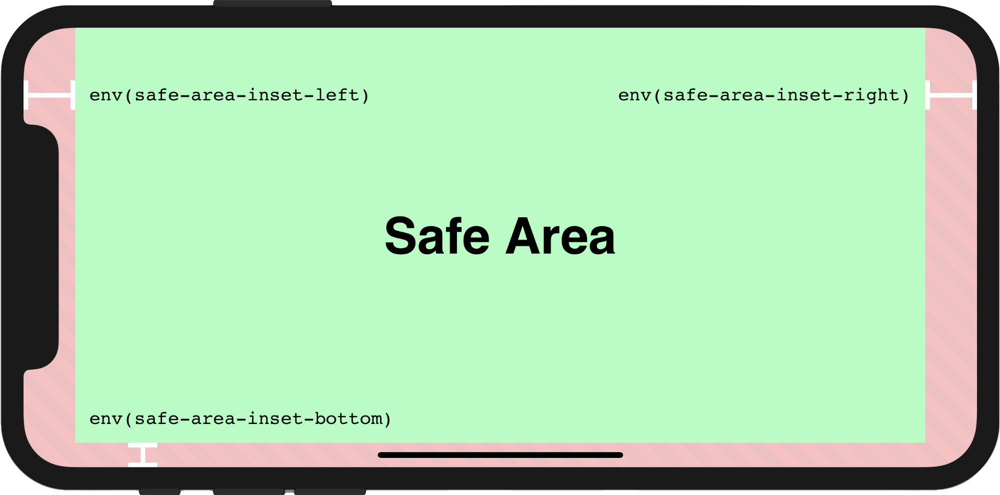

# useScreenSafeArea

响应式 `env(safe-area-inset-*)`



## 演示

### 基础使用

<demo src="./demo.vue" title="useScreenSafeArea" desc=""></demo>

### 组件使用

```html
<UseScreenSafeArea top right bottom left>content</UseScreenSafeArea>
```

## 注意

为了让页面完全呈现在屏幕上，必须首先设置`meta`标记`viewport-fit=cover`内的附加属性，视口元标记可能如下所示：`viewport`

```html
<meta name='viewport' content='initial-scale=1, viewport-fit=cover'>

```

更多详细信息，您可以参考此文档：[Designing Websites for iPhone X](https://webkit.org/blog/7929/designing-websites-for-iphone-x/)


## 类型

```ts
/**
 * 响应式 `env(safe-area-inset-*)`
 *
 * @see https://vueuse.org/useScreenSafeArea
 */
export declare function useScreenSafeArea(): {
  top: Ref<string>
  right: Ref<string>
  bottom: Ref<string>
  left: Ref<string>
  update: () => void
}
```
